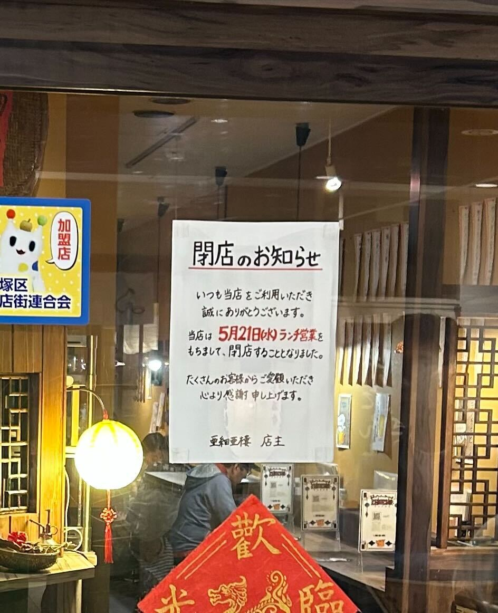

『亜細亜楼〜爺爺(イエイエ)の「ワンタンと豚バラの店」』が、\
**2025年5月21日(水) ランチ営業** を最後に閉店することが Instagram で発表されていました。
お店の入り口にも閉店のお知らせが掲示されています。

- - -

## 店主からのメッセージ（Instagramより一部抜粋）

> **「開店から約2年と短い時間でしたが、その間たくさんのお客様にご来店いただき、本当に感謝の想いで胸がいっぱいです。」**
>
> **「昭和37年に始まった亜細亜楼の物語を、再びこの地で紡ぎたいという想いは達成できたと感じています。」**
創設は昭和37年――商店街再開発で一度姿を消し、\
18年の時を経て **“懐かしい味と新しさ”** を掲げ復活。\
ワンタンや豚バラの香りに誘われた昼下がりの記憶は、多くの常連客の中に刻まれています。

思い出の一杯を味わいに足を運んでみてはいかがでしょうか。
店主・柳澤さんの笑顔とともに、最後の日まで温かな時間が流れますように。

- - -

参考リンク

* [公式 Instagram](https://www.instagram.com/ajiarou_ieienomise/)
