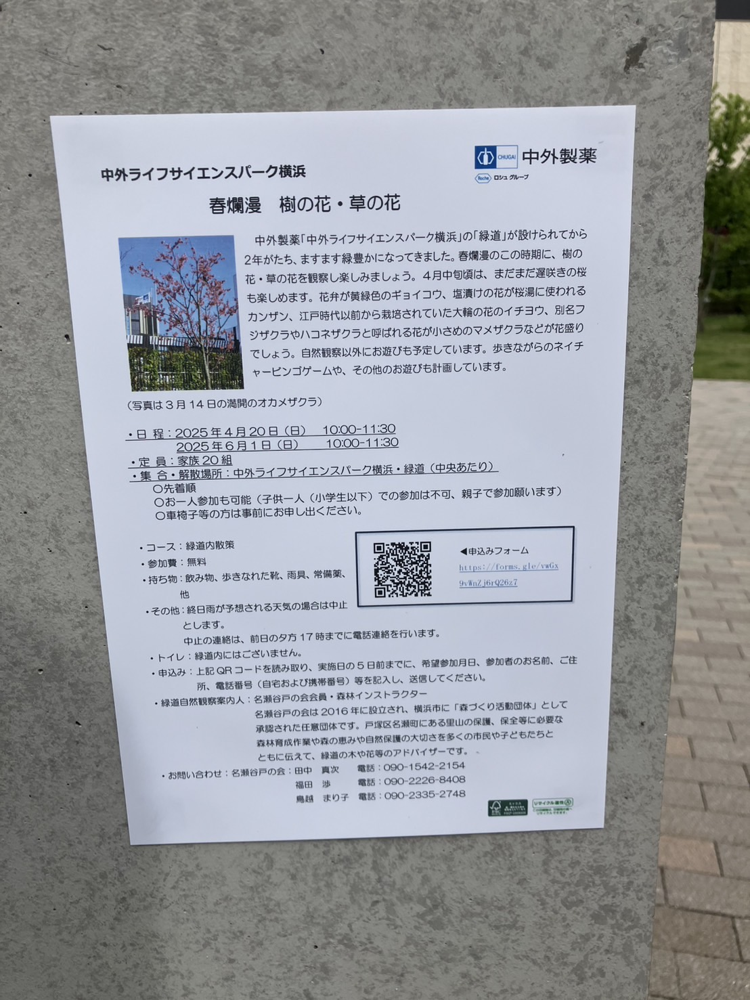
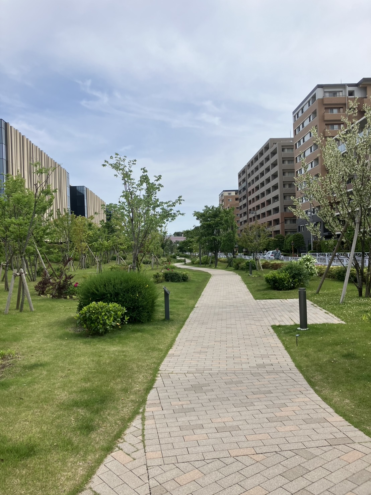

中外ライフサイエンスパークの緑道で散策イベントがやっているようです。
名瀬谷戸の会会員の森林インストラクターの方が案内人になって、樹の花や草の花を観察できるみたいです。
**定員が家族20組、先着順**とのことですので、興味のある方はしっかりマークしておきましょう！

中外ライフサイエンスパークの緑道、お散歩にとても良いですよね。癒される～
筆者が今日訪れたときには、赤ちゃん連れやお年寄りまでいろんな方がお散歩を楽しんでました。のどかな雰囲気です。

旭町通商店街を抜けてまっすぐ行くと**中外ライフサイエンスパーク横浜**に突き当たります。そこから右に曲がってすぐ左側にあるのが「緑道」です。ご存じない方も、これを機に訪れてみてはいかがでしょうか！
