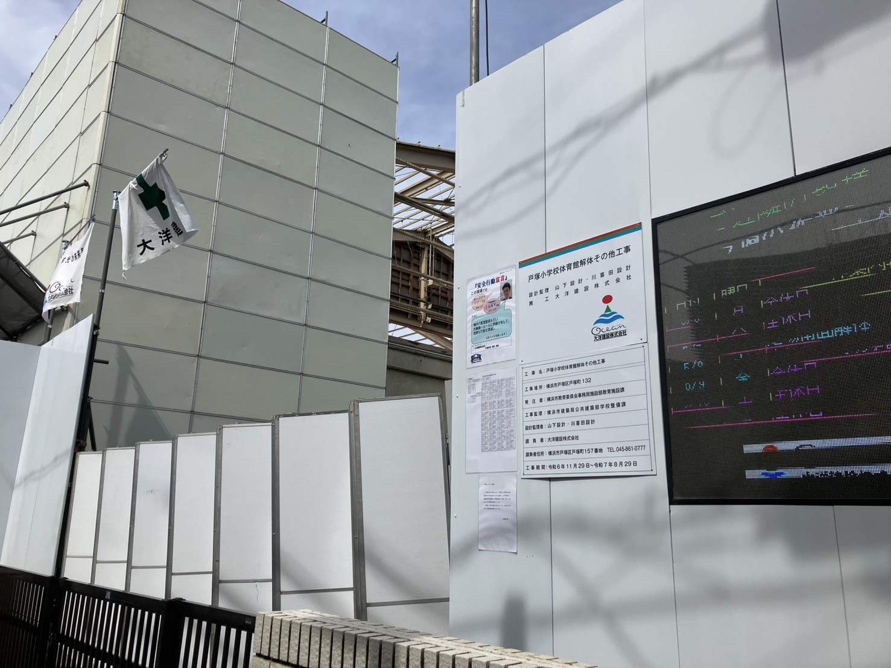
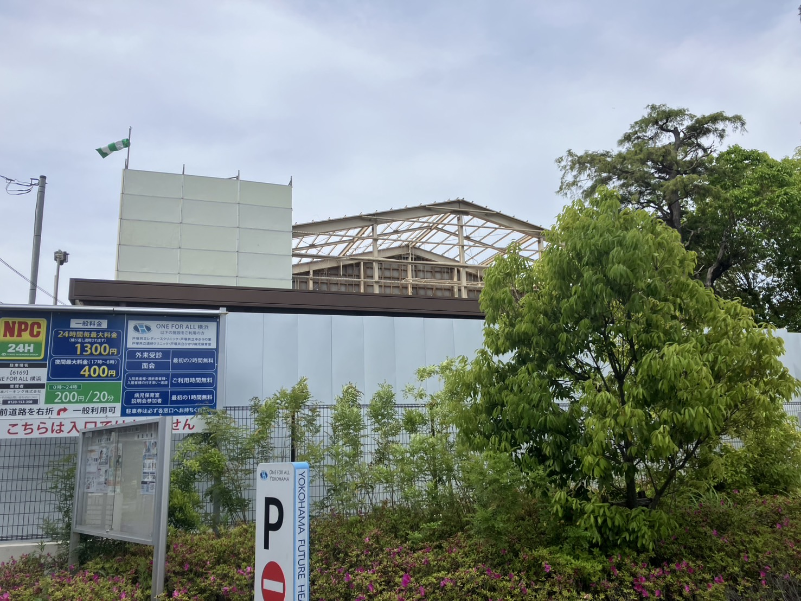

戸塚小が校舎の建て替え工事中みたいです。結構大規模に工事してますね！
旭町通商店街のところから見えるので、気になってる人も多いんじゃないでしょうか。

今は体育館の解体工事をやっているみたいです。

体育館の骨組みってこんな感じになってるんですね！

横浜市の資料（※１）によると、全部の工事が終わって供用が開始されるのが令和10年（2028年）だとか。
新しい校舎が完成するのが楽しみですね！

※１：[横浜市公共事業評価委員会（令和３年度第２回）](https://www.city.yokohama.lg.jp/city-info/zaisei/fmsuishin/jigyohyoka/r03/reiwa3dai2kaiiinkai.files/0046_20220224.pdf)
