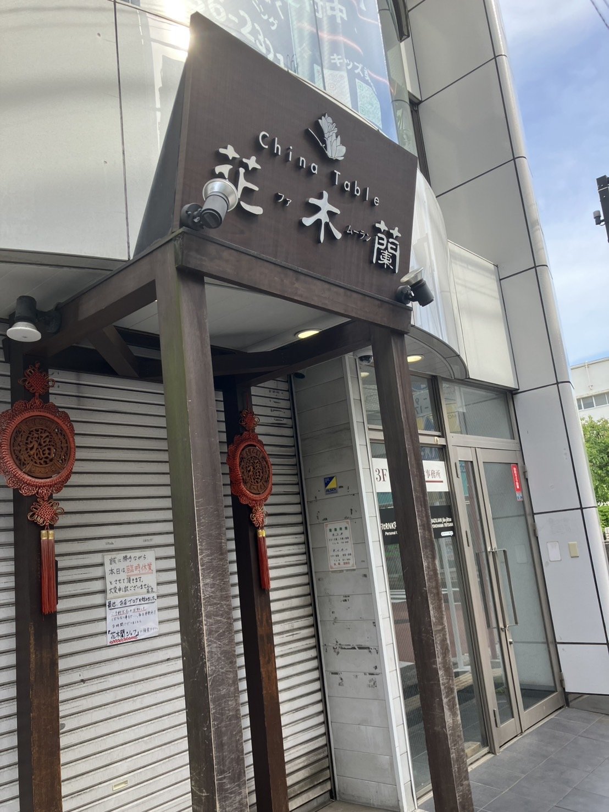
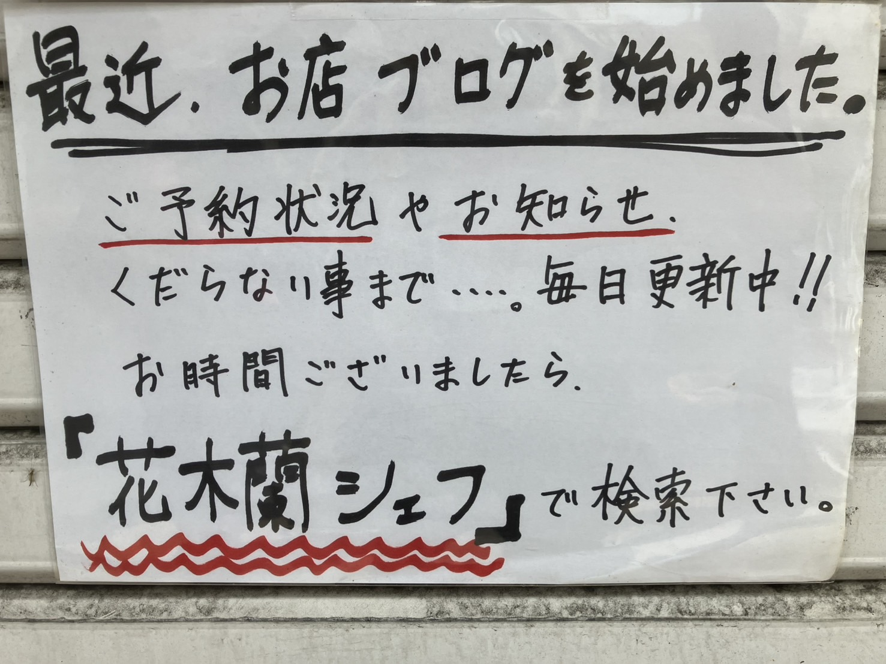

戸塚の名店「花木蘭（ファムーラン）」のオーナーシェフ・町田さんがブログをやってるみたいです。
https://ameblo.jp/hiroaki1122/

常連の方はご存じかと思いますが、おすすめメニューや裏メニュー、料理のこだわりまで、**10年以上にわたってほぼ毎日更新**されてるみたいです。読み応えがありますね！
臨時休業のお知らせなんかも更新されてますので、行く予定のある方は必見です！

