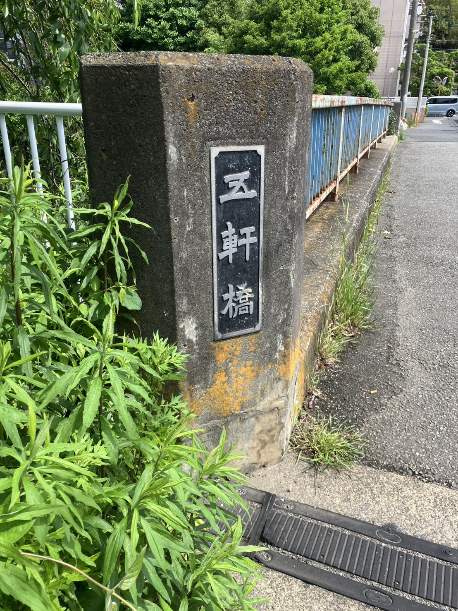
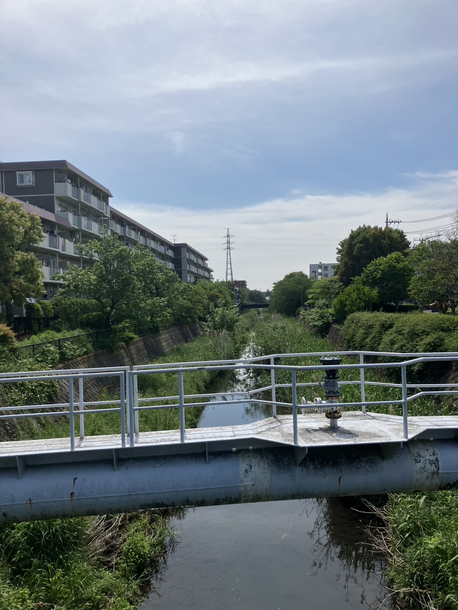
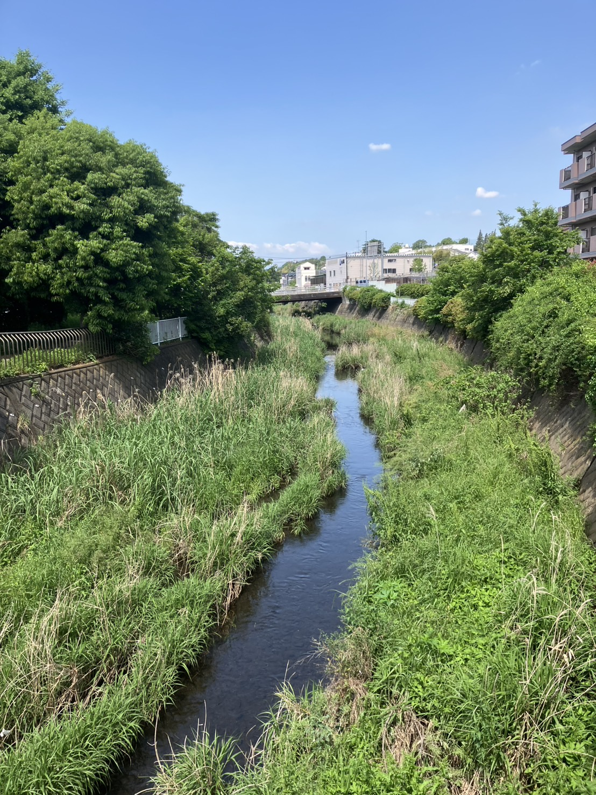
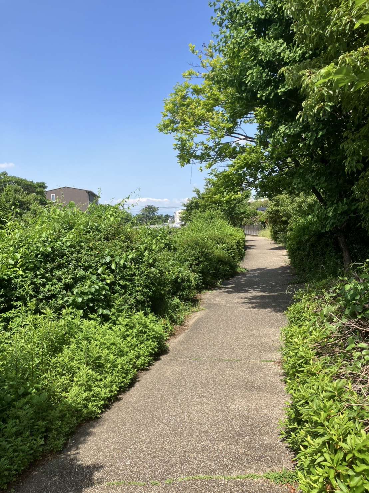

戸塚って、都会と田舎のバランスが絶妙ですよね。
駅前はなんでもそろう大都会、でもそこから10分も歩けば田園風景が広がったり…。
いわば、"トカイナカ"って感じでしょうか。

今日は、そんなトカイナカのちょっと懐かしい、心がほっとする風景をご紹介します。

戸塚駅の東側に伸びる旧国道一号線に沿って進み、JRの線路をまたいで更に進むと、そこは**上矢部**。
駅前の喧騒とは打って変わって、一戸建てやマンションが立ち並ぶ住宅街です。
でも、そんな家々の間にはちょっと懐かさを感じるスナックや食堂が。
なんだか心がほっとする、素敵な戸塚の街並みです。

上矢部の街を阿久和川に沿ってさらに進むと、泉区との境界のすぐ近くに見えてくるのが**五軒橋**。
今日の主役です。

五軒橋から川の下流（戸塚駅方面）を見たときの景色はこんな感じ。

上流（泉区方面）を見たときの景色はこんな感じ。

どうでしょう、なんだか「日本の原風景」って感じしませんか？
お散歩がてら、少し立ち寄ってみてはいかがでしょう。

ちなみにお散歩といえば、阿久和川沿いには結構きれいな遊歩道があります。

昼間にはのんびりお散歩する方もちらほら。また行ってみようと思います！

※バスを使う方へ：すぐ近くの「下岡津」バスから戸塚駅方面へのバスの行き来があります。日中だと約10分間隔で来ているイメージ。
