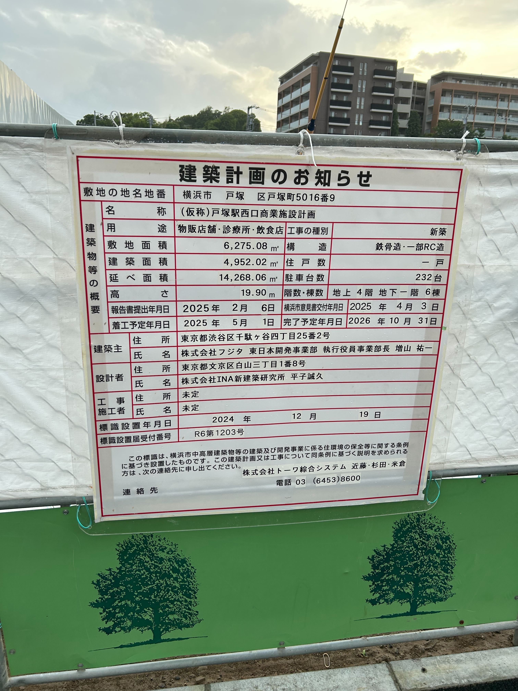

駅西口（旧戸塚住宅公園跡地）で大型の商業施設が建設中です。  
現地の建築計画看板によれば **2025 年 5 月着工 → 2026 年 11 月開業予定** とのこと。

2025年5月現在の様子↓

## 入居テナント（予定）

* 食品スーパー
* ドラッグストア
* 物販店・飲食店
* クリニックモール（内科・小児科・整形外科 など複数科想定）

※ 現時点ではテナント名は未公表。今後の情報に期待です！

## まとめ

* **戸塚駅西口の住宅公園跡地で 4 階建て商業施設が建設中**
* **2026 年 11 月オープン予定（2025 年 5 月着工）**
* **スーパー・ドラッグストア・飲食・クリニックモールなど生活密着型テナントが入居見込み**

「西口から家までの買い物ルートが変わりそう！」「仕事帰りに寄れるクリニックが増えるかも」など、今から期待が高まります。続報や現地写真を見かけたらぜひ教えてください！

---

### 参考リンク

- [コムコム.com「戸塚駅近！商業施設内新築クリニック【地上2階】」](https://comu-comu.com/property/4041/5568)
