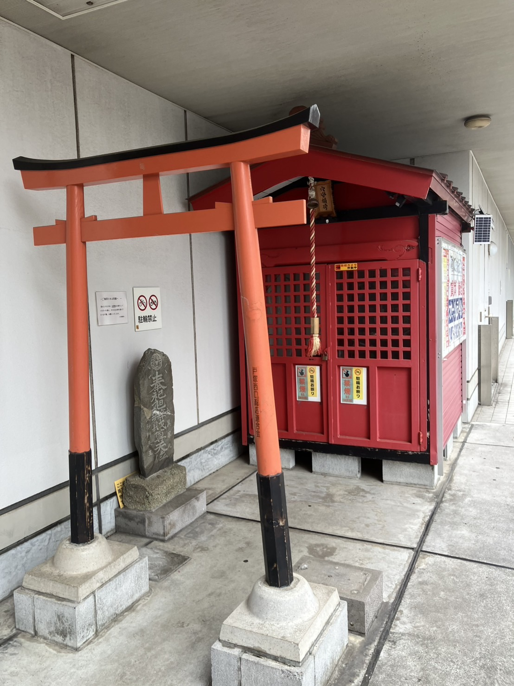

トツカーナモールと戸塚区役所の間の道路に面したところにひっそりたたずむお社。
戸塚駅西口を使う人なら良く目にするんじゃないでしょうか。

気になってちょっと調べてみたんですが、「戸塚穴守稲荷」というみたいです。
羽田にある「穴守稲荷神社」の御分霊を祀っているんじゃないか、という情報も出てきますが、詳しいことはよくわからず…。
ご存じの方いたら教えてください！

ちなみに、時々御開帳されているみたいです。次寄ったときも注目してみます～。

出典：[戸塚パルソ通信＠メール 第117号](https://www.totsuka-pallso.jp/mailmagazine/yado/117.html)
