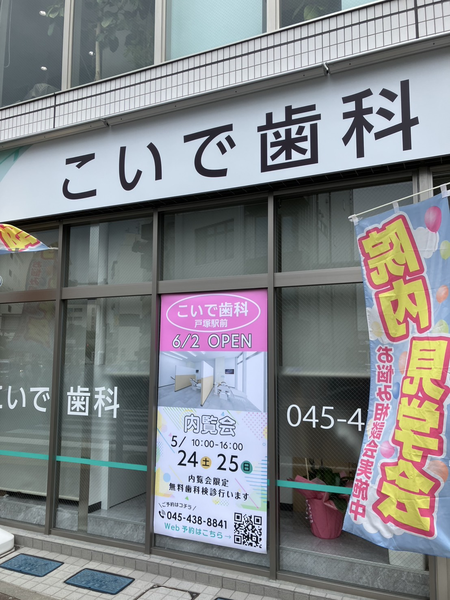

戸塚駅東口の大踏切跡の近くに、「**こいで**歯科」という歯医者さんが新しくできるみたいです！
オープンは**6/2（月）**で、5/24（土）と25（日）は内覧会をやっているとか。
内覧会では無料で歯科検診してくれるみたいです。

入口のところでビラ配ってました。
駅チカなので、通学・通勤の行き帰りなんかにも寄りやすそうです。

ところで戸塚駅周辺ってどのくらい歯医者あるんだろう？と思ってGoogle Mapで調べてみました。
そしたら、戸塚駅の徒歩10分圏内になんと驚愕の**20軒**。（数え間違ってたらすみません、、）
いやあ、便利すぎてコレでほんとにいいのかな、、とか思っちゃいますね、、笑
