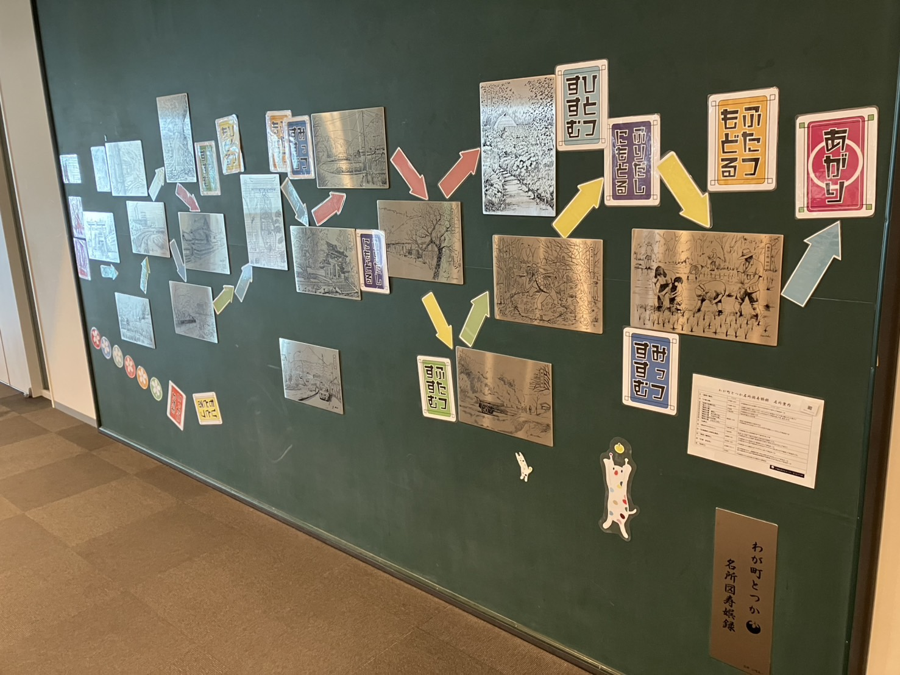
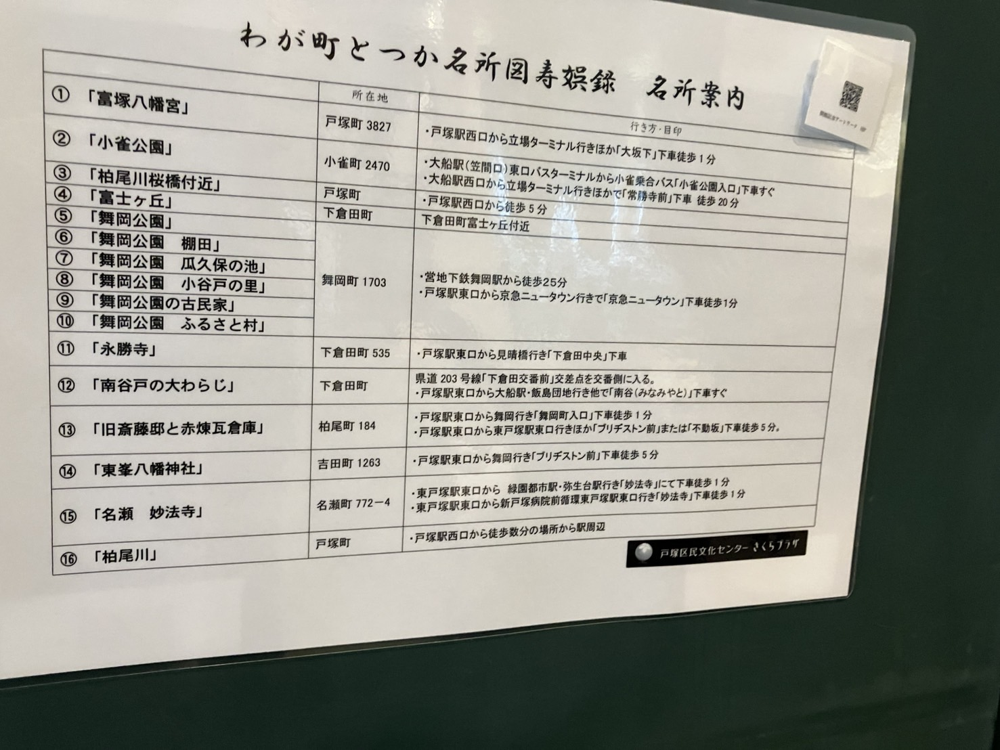

戸塚区役所４階「さくらテラス」の受付向かいの壁に、「わが町とつかすごろく」がおいてありました！
なんと受付でサイコロを貸してもらえるんだとか！お子さんと一緒に遊んだりするのも楽しいですが、大人だけでも結構楽しめる気がします笑　（筆者は時間がなくてパスしました、次は絶対…！）

色とりどりでかわいいですよね！職員の皆さんのこだわりが随所にちりばめられています。見ているだけでワクワクしてきますね。

ちなみにこのすごろくで取り上げられている戸塚の名所が一覧になってました。

（すごろくってこんな字書くんだ…）

というわけで、戸塚ぽーたるではこれから　#わが町とつか　というタグでゆるりと名所を巡ってみようと思います！お楽しみに～
